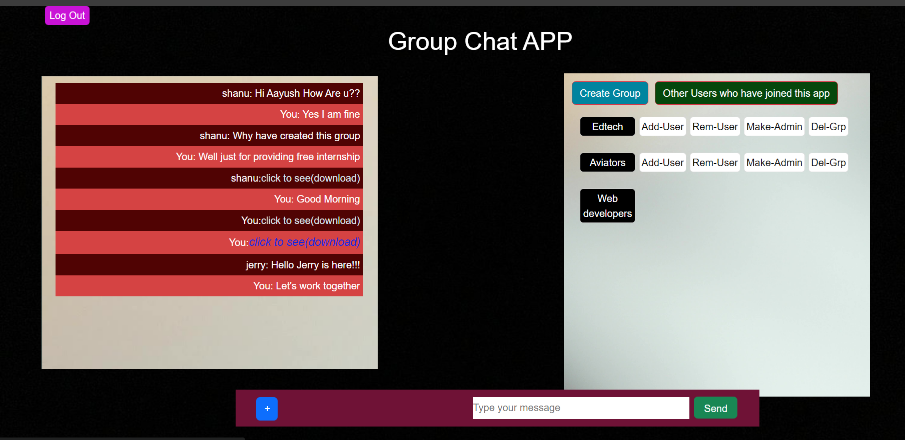

# Group-Chat-App

Group-chat app has been made with the modern technologies like Express.js, Node.js and MySQL database. This Web-application contains features like:

- User can Login and Sign-up with token generating using jsonweb token library for the Authentication purpose
- Can have One-One and Many-Many conversation with anyone in the group
- The app features users being able to send text files and images in chatbox,and AWS S3 Bucket is used to store those files.
- Users can create groups, add friends, and make other members admins.
- Additionally, the app is being used in real-time responsiveness scenario for chatting using Socket.io.

## Tech Stack

**Frontend:** HTML, CSS, Javascript

**Backend:** Node, Express

**Database:** MySQL, AWS RDS

**Libraries:** Bcrypt, Aws-sdk, http, dotenv, socket.io

**Cloud System:** EC2 instance, S3-Bucket, Nginx, Jenkins

## To Run Application Locally

```bash
  $ git clone https://github.com/kaayush163/GroupChat-WebApp.git
```

```bash
  $ cd GroupChat-WebApp
```

```bash
  $ npm i
```

```bash
  $ Change Database Username and Password in util/database.js file
```

```bash
  $ npm start
```

## Screenshots

| Group Chats display with document sharing represented by [click to see(download)] |
| :-------------------------------------------------------------------------------: |
|                                      |
